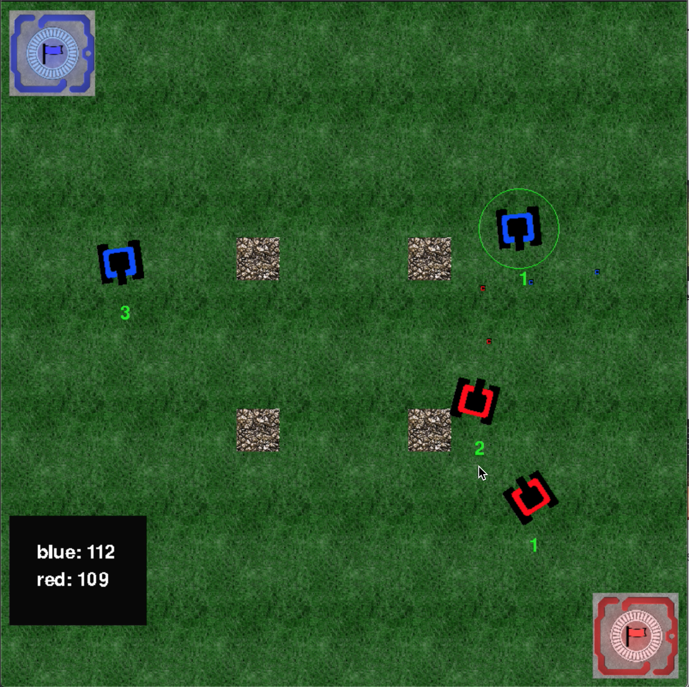

# PYFLAGS

## Intro
PyFlags is a real time strategy game where the player controls tanks to capture the enemy flag and returns it to home base.

This game was written in **Python 3.8.1** using **Pygame 2.0.0.dev6** library.

The following elements where written from scratch: **Collision detection. Game objects such as tanks, bullets, obstacles, flags and base. Simple Artificial Intelligence. Tank controls.**

## Getting started

`python3 py-flags.py blocks -ff`

blocks is the name of a map in the maps directory. The optional -ff flag turns on friendly fire.

## Controls
Human players select tanks by pressing 1, 2 or 3 on the keyboard. To move a selected tank, click anywhere on the screen. To tell a selected tank to fire, press spacebar.

Pressing a combination of 1, 2 or 3 in quick succession will select multiple tanks. To deselect the a tank and select a new one, simple wait a little bit then press the number for the desired tank.

## Points
One point is given for possessing the flag and one hundred points are given for returning the enemy flag to your base.

## Artificial Intelligence
Additional AI can be created using artificialIntelligence.py as an example.

## Maps:
Additional maps can be creating using `maps/blocks.json` as an example.

## AI vs AI
It is possible to have the AI battle itself by setting all the human attributes to false in the map (e.g. blocks.json).

### Screenshot

### Video
https://youtu.be/8x3UxfV-eIA